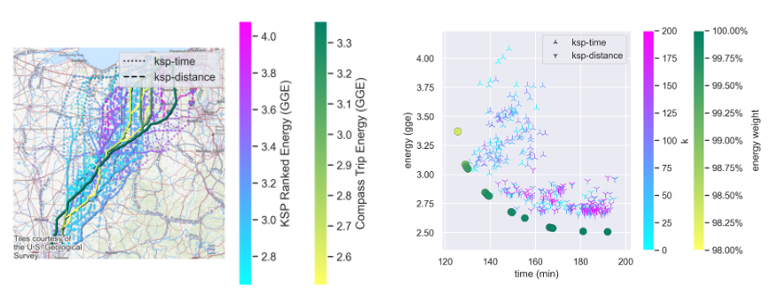

# Motivation

RouteE Compass was developed at NREL to support energy prediction in mesoscopic route planning, a cornerstone of many areas of mobility research science.
Many such projects attempting to explore routing hit scaling roadblocks that cannot be solved when attempting to use open source libraries in Python or R or route planning APIs.
Compass attempts to overcome these roadblocks by bringing scalable, energy-aware route planning to a data science notebook or to an HPC environment.

> _Left: An exploration of energy consumption with respect to routing algorithm choice. Routes ranging from blue to pink use a k-shortest path (KSP) algorithm with either a time or distance objective. Routes from yellow to green use endogenous energy estimation and a generalized cost model sweeping energy cost weight from 98% to 100%._
>
> _Right: The KSP routes are shown to have random optimality with respect to time and energy, while the routes using a generalized cost model find the pareto-optimal set of paths between time and energy-optimal, with the cost-optimal path found along the pareto frontier._

## Compass Features

The core features of RouteE Compass are 

  - it provides a **dynamic cost function** API, 
  - it is designed for **batch parallel execution**, 
  - it **computes energy endogenously**,
  - it has an **extensible model API** allowing it to become a lightweight framework for applications that leverage route planning.
Each feature is described below in detail.

### Dynamic Cost Function

Perhaps most counter-intuitive is the dynamic cost function.
With this, a user can specify **at query time** a set of objective weights that dial in a particular stated preference between distance, time, energy, and any other dimensions of the routing model.
As a result, network weights are _not static_, which rules out many route planning innovations geared toward improving scalability.
As a result, Compass must rely solely on its high-performance implementation of A* Algorithm for runtime optimization.

### Batch Execution

To squeeze the most amount of speed out of A*, the routing model is shared as a read-only dataset across all available system threads, allowing for batch parallel execution of the queries.
This scales well on HPC systems, since it requires only one copy of the network model in memory, and can be duplicated horizontally without loss of generality.
Parameters can be set in order to manage the resource utilization of each thread, which can prematurely cancel searches headed to an out-of-memory panic without causing the system to fail.

### Endogenous Energy Estimation

In order to leverage energy estimation in-the-loop of the dynamic cost function, it is calculated dynamically during the search using RouteE Powertrain models.
This allows time-of-day features to impact the energy model such as network speeds or ambient temperature.

### Extensible Model API

The routing model is broken into three components: the **Filter Model** and **Traversal Model**.
Each slices off an aspect of a single iteration of a traditional path search.

The **Filter Model** serves to restrict travel over links based on criteria such as the road classification, turn restrictions, or vehicle restrictions.
It is invoked before adding a link to the frontier of unexplored links.

The **Traversal Model** computes changes to the state tuple due to traversing a single link.
This is where link travel time and link distance are recorded, and also where link distance, grade and speed can be used to estimate the energy consumption.

## Links

- [RouteE Powertrain](https://nrel.github.io/routee-powertrain/intro.html) library documentation
- [RouteE Compass Extensible API](https://docs.rs/routee-compass/latest/routee_compass/#custom-models) library documentation