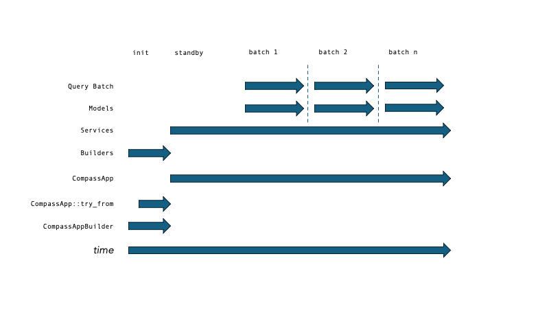

This crate provides the application runtime for the RouteE-Compass energy-aware routing engine. For more information, visit [https://www.nrel.gov/transportation/route-energy-prediction-model.html](https://www.nrel.gov/transportation/route-energy-prediction-model.html).

This crate is part of a [workspace](https://doc.rust-lang.org/book/ch14-03-cargo-workspaces.html) and depends on two other crates from that workspace:

* [routee-compass-core](https://docs.rs/routee-compass-core/) - core data structures and algorithms used by Compass
* [routee-compass-powertrain](https://docs.rs/routee-compass-powertrain/) - traversal model supporting energy-optimal route planning via [RouteE Powertrain](https://github.com/nrel/routee-powertrain)

This document provides an introduction to working with RouteE Compass by introducing the following concepts:

  1. [Modules](#modules)
      - [CompassApp](#compassapp)
      - [SearchApp](#searchapp)
      - [InputPlugin](#inputplugin)
      - [OutputPlugin](#outputplugin)
  2. [Usage](#usage)
      - [Building CompassApp instances](#building-compassapp-instances)
      - [Running queries on CompassApp](#running-queries-on-compassapp)
  3. [Resource Utilization](#resource-utilization)
  4. [Extending Compass](#extending-compass)
    - [Custom Models](#custom-models)

## Modules

### CompassApp

A [CompassApp] is a value containing the system configuration, the [SearchApp], and the collection of [InputPlugin]s and [OutputPlugin]s instantiated by this configuration, each described below. 

The following graphic shows generally the lifecycle for the primary objects of a Compass app.




##### SearchApp

The [SearchApp] is a value containing the various long-running assets that can create [SearchInstance] objects for each query. 
In some cases these are final models such as the [Graph] and [MapModel] instances. 
In other cases these are services such as the [TraversalModelService] which will build a [TraversalModel] instance based on the contents of the user search query.
See [routee-compass-core](https://docs.rs/routee-compass-core/) documentation for more information on the relationships between model and service types.

##### InputPlugin

Input plugins pre-process the incoming user queries as JSON before submitting them to the [SearchApp]. 
For more information, see[`crate::plugin::input::InputPlugin`].

##### OutputPlugin

Output plugins post-process the outgoing search results as JSON after submitting them to the [SearchApp]. 
For more information, see[`crate::plugin::output::OutputPlugin`].

## Usage

### Building CompassApp instances

A RouteE Compass app exists as a value of type [CompassApp] on a given system.
An instance can be built using one of two `try_from` methods:
  1. from a path, which assumes the default [CompassAppBuilder]
  2. from an instance of [Config](https://docs.rs/config/latest/config/) along with a (possibly customized) [CompassAppBuilder]

Customizing a [CompassAppBuilder] is the extension point for adding 3rd party extensions to [CompassApp].
If this is not needed, then sticking to the default is sufficient, via the `CompassApp::try_from(path)` builder method.

#### Running queries on CompassApp

With a running instance of [CompassApp], one can repeatedly issue queries via the `run` method:

```ignore
use serde_json::{Value, to_string_pretty};
use std::path::Path;

let config_path = Path::new("config.toml");
let queries: Vec<Value> = vec![];  // each value is a JSON query
let app = CompassApp::try_from(config_path).unwrap();
for query_file in query_files {
  let responses: Vec<serde_json::Value> = app.run(queries).unwrap();
  for res in responses {
    let res_str = to_string_pretty(&res).unwrap();
    println!(res_str);
  }
}

```

### Resource Utilization

#### CPU Usage

Based on the configured `parallelism` value, the batch of queries will be split into chunks run across the available system threads.
Keep in mind that each chunk needs enough RAM to conduct a (single) complete search over your road network.
For example, if a road network has 1 million links, and parallelism is 8, then _(in the worst case)_ there should be sufficient RAM to store 8 million rows of search data at a time to avoid out-of-memory errors. 
To manage resource utilization within each thread, use [TerminationModel] arguments (`[termination]` in the configuration TOML file).

#### Memory Usage

Memory use of each query is reported in MiB by profiling the resulting search tree(s) by way of the [Allocative](https://crates.io/crates/allocative) crate.
Memory requirements for the CompassApp at this time are not reported.

### Extending Compass

In order to add capabilities to Compass, you can choose from a number of trait objects to implement your solution.
The way this is typically done is as follows:
  1. write custom models or input plugins
  2. create a [CompassAppBuilder] object and inject your custom modules into it
  3. create your own run application (such as a `fn main`) which uses your [CompassAppBuilder] to create a [CompassApp]

#### Custom Models

The [traversal], [access], and [frontier] modules all contain Builder, Service, and Model traits that can be implemented. 
For each new type of model, you must implement the builder and service as well, such that
  - your builder is an empty struct (e.g. `pub struct MyBuilder {}`)
  - your builder's `build` method creates or reads all data related to your model that can be shared across all queries (see lifetime image, above)
  - your service's `build` method can gather values from the incoming query that may further paramerize or override your service while producing a model for the incoming query
  - while your service is available for _all_ queries, your model is available for _exactly one_
  - your model and service should be [thread-safe](https://en.wikipedia.org/wiki/Thread_safety)

For an example, review the implementation of the built-in models:
  - [`routee_compass_core::model::traversal::default`]
  - [`routee_compass_core::model::access::default`]
  - [`routee_compass_core::model::frontier::default`]

To understand how these each interact with the state model, review the documentation of the [state] module.

#### Custom Plugins

Plugins do not have multi-phase builders as the dynamic models above, but instead, are constructed once during CompassApp initialization.
For both [InputPluginBuilder] and [OutputPluginBuilder], they should similarly be empty structs (e.g., `pub struct MyPlugin {}`).
For examples, review the implementation of the built-in plugins:
  - [`crate::plugin::input::default`]
  - [`crate::plugin::output::default`]

[CompassApp]: crate::app::compass::CompassApp
[SearchApp]: crate::app::search::SearchApp
[SearchInstance]: routee_compass_core::model::search::SearchInstance
[CompassAppBuilder]: crate::app::compass::CompassAppBuilder

[traversal]: routee_compass_core::model::traversal
[access]: routee_compass_core::model::access
[frontier]: routee_compass_core::model::frontier
[state]:routee_compass_core::model::state

[TraversalModelBuilder]: routee_compass_core::model::traversal::TraversalModelBuilder
[TraversalModelService]: routee_compass_core::model::traversal::TraversalModelService
[TraversalModel]: routee_compass_core::model::traversal::TraversalModel

[AccessModelBuilder]: routee_compass_core::model::access::AccessModelBuilder
[FrontierModelBuilder]: routee_compass_core::model::frontier::FrontierModelBuilder

[TerminationModel]: routee_compass_core::model::termination::TerminationModel

[InputPluginBuilder]: crate::plugin::input::InputPluginBuilder
[InputPlugin]: crate::plugin::input::InputPlugin
[OutputPluginBuilder]: crate::plugin::output::OutputPluginBuilder
[OutputPlugin]: crate::plugin::output::OutputPlugin

[routee-compass-core]: routee_compass_core
[routee-compass-powertrain]: routee_compass_powertrain
[routee-compass]: self
[Graph]: routee_compass_core::model::network::Graph
[MapModel]: routee_compass_core::model::map::MapModel